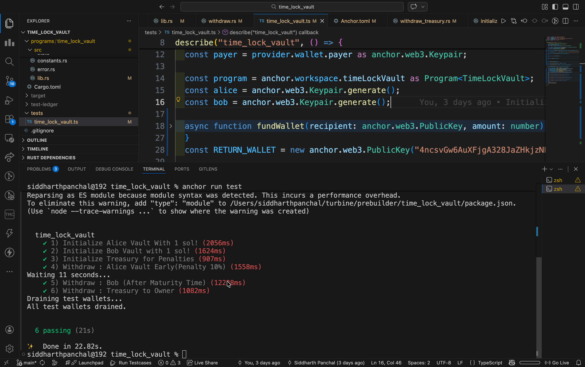
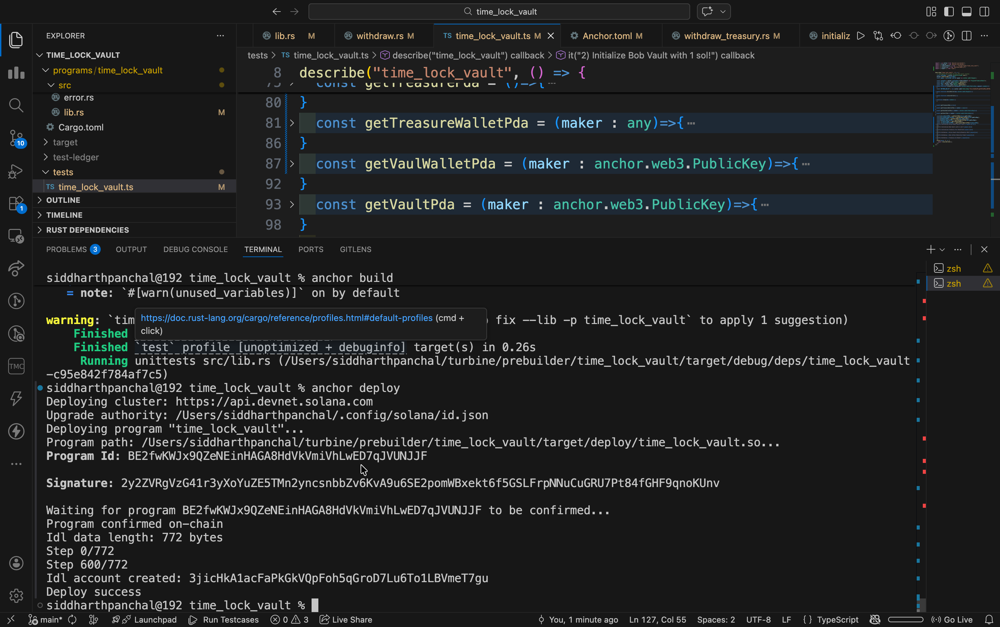

# ⏳ TimeLockVault — Anchor / Solana

A Solana smart contract built with the [Anchor framework](https://www.anchor-lang.com/) that implements a **time-locked vault system** with early withdrawal penalties. Users lock SOL for a defined duration and receive their full deposit back upon maturity — or face a 10% penalty for early withdrawal.

---

## 🚀 Devnet Deployment


| Field          | Value                                                                                                     |
| ---------------- | ----------------------------------------------------------------------------------------------------------- |
| **Program ID** | `BE2fwKWJx9QZeNEinHAGA8HdVkVmiVhLwED7qJVUNJJF`                                                            |
| **Network**    | Solana Devnet                                                                                             |
| **Explorer**   | [View on Solscan](https://solscan.io/account/BE2fwKWJx9QZeNEinHAGA8HdVkVmiVhLwED7qJVUNJJF?cluster=devnet) |

---

## 📸 Test Results





<!-- Example:

-->

---

## 📋 Program Summary

TimeLockVault is a non-custodial, trustless vault where users can:

- **Lock SOL** for a specified duration
- **Withdraw at maturity** to receive 100% of their deposit
- **Withdraw early** and receive 90%, with 10% sent to a protocol treasury as a penalty

The design cleanly **separates state accounts from fund-holding accounts** and uses PDA signer seeds for all secure fund transfers — no external signers required.

---

## ✨ Core Features


| Feature              | Description                                            |
| ---------------------- | -------------------------------------------------------- |
| 🔒 Time-locking      | Lock any amount of SOL for a custom duration           |
| 💰 Full withdrawal   | 100% refund after maturity date                        |
| ⚡ Early withdrawal  | 90% refund; 10% penalty sent to treasury               |
| 🏦 Treasury          | Global PDA accumulates and tracks all penalties        |
| 🔑 Authority control | Treasury authority can withdraw and close the treasury |
| 📦 Clean PDA design  | Separate state and wallet PDAs for each entity         |

---

## 🗂️ PDA Structure

```
["vault", user_pubkey]
    └── Vault state account (stores lock metadata: amount, duration, start time)

["vault_wallet", user_pubkey]
    └── Vault wallet PDA (holds the actual deposited SOL)

["treasury"]
    └── Treasury state account (stores authority pubkey + total penalties accumulated)

["treasury_wallet", treasury_pubkey]
    └── Treasury wallet PDA (holds all penalty SOL)
```

---

## 🔄 Program Flow

```
┌─────────────────────────────────────────────────────────────────┐
│                        USER FLOW                                │
│                                                                 │
│  1. initialize_vault()                                          │
│     └── Creates Vault PDA + Vault Wallet PDA                    │
│                                                                 │
│  2. deposit()                                                   │
│     └── SOL transferred from user → Vault Wallet PDA            │
│                                                                 │
│  3. withdraw()                                                  │
│     ├── [After maturity]  → 100% returned to user               │
│     └── [Before maturity] → 90% to user, 10% to Treasury Wallet │
└─────────────────────────────────────────────────────────────────┘

┌─────────────────────────────────────────────────────────────────┐
│                      TREASURY FLOW                              │
│                                                                 │
│  4. withdraw_treasury()                                         │
│     └── Treasury authority claims all accumulated penalties     │
│                                                                 │
│  5. close_treasury() [optional]                                 │
│     └── Closes the treasury PDAs and reclaims rent              │
└─────────────────────────────────────────────────────────────────┘
```

---

## 🏗️ Account Architecture

### Vault State (`["vault", user_pubkey]`)

Stores vault metadata — does **not** hold SOL directly.


| Field           | Type     | Description                           |
| ----------------- | ---------- | --------------------------------------- |
| `owner`         | `Pubkey` | The user who created the vault        |
| `amount`        | `u64`    | Amount of SOL deposited (in lamports) |
| `lock_duration` | `i64`    | Lock period in seconds                |
| `start_time`    | `i64`    | Unix timestamp of deposit             |
| `bump`          | `u8`     | PDA bump seed                         |

### Vault Wallet (`["vault_wallet", user_pubkey]`)

A system-owned PDA that **holds the actual SOL**. No data fields — pure fund storage.

### Treasury State (`["treasury"]`)

Tracks global penalty accumulation.


| Field             | Type     | Description                      |
| ------------------- | ---------- | ---------------------------------- |
| `authority`       | `Pubkey` | Authorized withdrawer            |
| `total_penalties` | `u64`    | Cumulative penalties in lamports |
| `bump`            | `u8`     | PDA bump seed                    |

### Treasury Wallet (`["treasury_wallet", treasury_pubkey]`)

A system-owned PDA that **holds all penalty SOL**.

---

## 🛠️ Instructions

### `initialize_vault`

Creates the Vault and Vault Wallet PDAs for the user.

```rust
pub fn initialize_vault(ctx: Context<InitializeVault>) -> Result<()>
```

### `deposit`

Transfers SOL from the user into the Vault Wallet and records lock terms.

```rust
pub fn deposit(ctx: Context<Deposit>, amount: u64, lock_duration: i64) -> Result<()>
```

### `withdraw`

Withdraws SOL from the vault. Automatically calculates penalty if before maturity.

```rust
pub fn withdraw(ctx: Context<Withdraw>) -> Result<()>
```

**Withdrawal logic:**

```
if current_time >= start_time + lock_duration:
    user receives 100% of deposit
else:
    penalty = deposit * 10%
    user receives deposit - penalty
    treasury_wallet receives penalty
```

### `withdraw_treasury`

Allows the treasury authority to claim all accumulated penalties.

```rust
pub fn withdraw_treasury(ctx: Context<WithdrawTreasury>) -> Result<()>
```

---

## 🧪 Running Tests

```bash
# Install dependencies
yarn install

# Run the full test suite against localnet
anchor test

# Run against devnet
anchor test --provider.cluster devnet
```

---

## 📦 Build & Deploy

```bash
# Build the program
anchor build

# Deploy to devnet
anchor deploy --provider.cluster devnet

# Verify deployment
solana program show BE2fwKWJx9QZeNEinHAGA8HdVkVmiVhLwED7qJVUNJJF --url devnet
```

---

## 📁 Project Structure

```
timelockVault/
├── programs/
│   └── time_lock_vault/
│       └── src/
│           ├── lib.rs              # Program entry point & instructions
│           ├── state.rs            # Account structs (Vault, Treasury)
│           ├── instructions/
│           │   ├── initialize.rs
│           │   ├── deposit.rs
│           │   ├── withdraw.rs
│           │   └── treasury.rs
│           └── errors.rs           # Custom error codes
├── tests/
│   └── time_lock_vault.ts          # Integration tests
├── Anchor.toml                     # Anchor configuration
└── Cargo.toml
```
